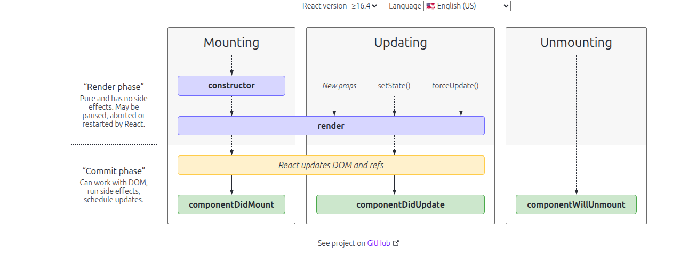

# Namaste React

A beginner-friendly React project demonstrating component structure, hooks, and modern tooling.

---

## 📁 Project Structure

```
src/
  components/
    Header.js
    Body.js
    Footer.js
    RestaurantCard.js
    Shimmer.js
  utils/
    constants.js
    mockData.js
  App.js
  index.js
```

---

## 🧩 Components

- **Header**
  - Logo
  - Menu
- **Body**
  - Search
  - RestaurantContainer
    - RestaurantCard (Image, Name, Star Rating, Cuisines, Delivery Time)
- **Footer**
  - Copyright
  - Links
  - Address
  - Contact

---

## 📝 Concepts

### Functional Component

A JavaScript function that returns JSX.

### Props

Arguments passed to a component.

---

## 🚀 Parcel

Parcel is a web application bundler that provides:

- Dev Build & Local Server
- Hot Module Replacement (HMR)
- File Watching (C++)
- Caching & Faster Builds
- Image Optimization
- Minification & Bundling
- Compression & Consistent Hashing
- Code Splitting & Differential Bundling
- Diagnostics & Error Handling
- HTTPS & Tree Shaking

---

## 📦 Export/Import Types

### Default Export/Import

```javascript
// Export
export default MyComponent;
// Import
import MyComponent from "./MyComponent";
```

### Named Export/Import

```javascript
// Export
export const MyComponent = () => {};
// Import
import { MyComponent } from "./MyComponent";
```
---

## ⚛️ React Hooks

- **useState**: Adds state to functional components.
- **useEffect**: Performs side effects (like data fetching).
- **useContext**: Accesses context values.
- **useRef**: Mutable values across renders.
- **useReducer**: Complex state logic.
- **useMemo**: Memoizes expensive calculations.
- **useCallback**: Memoizes callback functions.

---

## ✨ Shimmer UI

A loading placeholder effect that mimics the layout of the content while data is loading, improving user experience.

---

## 🖥️ Virtual DOM

A lightweight representation of the actual

DOM that React uses to optimize updates. It minimizes direct DOM manipulation, leading to better performance.

## React lifecycle



/*****
* ---- MOUNTING ----
*
*     Constructor(dummy)
*     Render(dummy)
*        <HTML Dummy>
*     Component did mount
*        <API CALL>
*        <this.setState> --> state variable is update
* ---- UPDATE --------
*      Render (API Data)
*      <HTML (new api data
* --- Unmounting -----
  */


